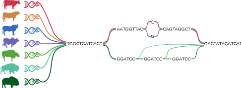
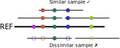

# Lecture 0

Introduction to pangenomics

Dr. Alexander Leonard  \
ETH Zürich

[alleonard@ethz.ch](alleonard@ethz.ch)

---

[//]: # (Day 1: 8.30am - 9.15am)

# What is a "genome"?

The definition of **genome** from [genome.gov](https://www.genome.gov/genetics-glossary/Genome) is

> the entire set of DNA instructions found in a cell.

For us, that is approximately 3,000,000,000 A/T/C/G nucleotides.

Chromosome 1 looks like
> CACCTAAACCCTAACCCCTAACCCTAACCCTAACCCT...GGTTAGGGTTAGGGTTAGGGTTAGGGTTAGGGTTAGGGTTAGGGTT

---

# Reference genomes

The human reference genome was assembled in 2001
 - International Human Genome Consortium. **Initial sequencing and analysis of the human genome**. *Nature*
 - Venter et al. **The sequence of the human genome**. *Science*

The human reference genome was actually completed in 2022
 - Nurk et al. **The complete sequence of a human genome**. *Science*

 Even that version has "limitations", including no Y chromosome!
  - Rhie et al. **The complete sequence of a human Y chromosome**. *Nature*

 ---

 # Reference genomes

What is the point of a reference genome?

The definition of **reference sequence** from [genome.gov](https://www.genome.gov/genetics-glossary/Human-Genome-Reference-Sequence) is
>an accepted representation ... that is used by researchers as a standard for comparison to DNA sequences generated in their studies.

So a reference is a "good enough" framework for us to consistently refer to the same genomic sequence.

 ---

 # Reference genomes

What do we use a reference genome for?

[//]: # (Interactive question)

 ---

 # Reference genomes?

The CHM13 genome represents *one* person, not all of us.

What about my genome?

What about my ~genome~ genome**s**?

---

# Enter the pangenome

Pangenomes are one solution to this problem of representing many genomes, or more formally [put](https://lh3.github.io/2024/03/29/what-is-a-pangenome) is
>a collection of well assembled genomes in a clade (typically a species) to be analyzed together.

Historically, pangenomes were used primarily in bacteria — many E. coli genomes only share ~50% of genes, so the "set" of genes was the "pangenome".

Now we might refer to a collection of *many* genomes as a pangenome.

---

# What is a "pangenome"?

In reality there are many types of pangenomes:
 - variation-based
 - sequence-based
 - gene-based
 - *k*mer-based

As a young field, no one definition has won yet. \
Each may have their own strengths and weaknesses.

---

# What is a "pangenome"?

TODO: make sure this figure renders correctly

---

# Why use a pangenome?

We want to mitigate **reference bias**, which is
> when reads containing non-reference alleles fail to align to their true point of origin.

This is especially relevant to agriculture, where "the same species" can be highly diverse.

Consider what happens if our sample is diverged (either in one region or the whole genome) compared to the reference. \
Genomics mutations/sequencing errors make aligners second-guess themselves...

---

# Why just now?

Pangenomes may seem like an obvious solution, but
 - assemblies *were* extremely expensive/hard to produce
 - computational power/algorithms were not sufficiently advanced
 - the scale of diversity (in humans at least) was underestimated

---

# Some guiding steps

The goals of this course are to gain familiarity with the rapidly evolving field of pangenomics, including:
 - performing analyses with long read data
 - constructing and assessing pangenomes
 - using pangenomes to find meaningful variation

If you don't find this challenging, please teach me!

---
