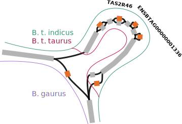
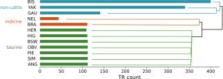
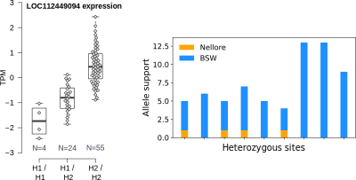

[//]: # (Day 5: 8.30am – 10.15am)

# Lecture 13

Finding functional associations within livestock pangenomes

Dr. Alexander Leonard  \
ETH Zürich

[alleonard@ethz.ch](alleonard@ethz.ch)

---

# Recap

We have learned about:
 - aligning short or long reads to pangenome graphs
 - manipulating GAF files
 - impracticalities of working with complex graphs

---

# Objectives

By the end of the lecture, we should be able to:
 - prioritise interesting regions for manual inspection
 - search pangenome graphs for disrupted genes
 - identify putative QTL bubbles associated with binary traits

---

# Overview

- "Functional" variants
- Easy approaches
- Hard approaches
- Possible future directions

---

# Functional variant hunting examples in livestock

Pangenomes are big and contain a lot of variation. \
Can we prioritise variants that are *more likely* to be meaningful?

What can we do with:
 - pangenomes
 - reference annotations
 - breed/group-specific traits
 - short read sequencing

---

# Functional variant hunting examples in livestock

Important to remember, this is just **prioritising**, not proving.

In the future, these may be the "first step" of a research project.

Some details might be simplified in the following examples.

---

# Gaur deletion of *TAS2R46*

Based on work from https://www.nature.com/articles/s41467-022-30680-2.

Leonard et al. **Structural variant-based pangenome construction has low sensitivity to variability of haplotype-resolved bovine assemblies**. *Nature communications* (2022).

Pangenome containing five cattle breeds (*B. t. taurus* and *B. t. indicus*) and one wild bovine (*Bos gaurus*).

Gaur diverged from cattle ~5M years ago, so what evolved in that time? \
Lots of mutations obviously, but which ones matter...

TODO: image of gaur?

---

# Gaur deletion of *TAS2R46*


We start with the reference annotation, converting GFF to BED.

```
1	ensembl	gene	339070	350389	.	-	.	gene_id "ENSBTAG00000006648"
1	ensembl	CDS		350267	350389	.	-	0	gene_id "ENSBTAG00000006648"

```
We then check structural variants unique to gaur/cattle that totally overlap genes.
Manually curate the handful of "affected" genes.

We'll do this later in the practical session!

---

# Gaur deletion of *TAS2R46*

BTA5 has a 17 Kb deletion unique to gaur that spans
 - *TAS2R46*
 - *ENSBTAG00000001336*



Easy to find as total overlap

---

# eVNTR for *LOC112449094* in cattle

Based on https://link.springer.com/article/10.1186/s13059-023-02969-y.

Leonard et al. **Graph construction method impacts variation representation and analyses in a bovine super-pangenome**. *Genome Biology* (2023).

Pangenome containing seven *B. t. taurus*, two *B. t. indicus*, and three wild bovine (*Bos gaurus*, *Bos grunniens*, and *Bison bison*).

Looking at VNTR (variable number tandem repeat) copy numbers in the graph.

---

# eVNTR for *LOC112449094* in cattle

Big outlier in copy number between non-cattle and cattle, worth following up.




We found within-breed variability in Braunvieh for which we had RNA-seq.

---

# eVNTR for *LOC112449094* in cattle

We found a strong association for increased *LOC112449094* expression with additional VNTR copies.



Can complete the story with allele-specific expression in the Nellore x Brown Swiss.

---

# Wisent deletion of *THRSP*

Based on the work in https://www.biorxiv.org/content/10.1101/2024.04.08.588592v1.

Bortoluzzi et al. **Wisent genome assembly uncovers extended runs of homozygosity and a large deletion that inactivates the thyroid hormone responsive gene**. *Biorxiv* (2024).

European (and American) Bison diverged ~1.5M years ago, and also have distinct habitats/adaptions.

We can be a bit more precise, and look for clade-specific SVs that overlap genes.

TODO: add upsetplot

---

# Wisent deletion of *THRSP*

We find a partial deletion of *THRSP* (complete deletion of exon 1). \
The other exon is noncoding, so this is effectively a full knockout.

Short reads support deletion (and ancestral reads).

TODO: add bandage

---

# Wisent deletion of *THRSP*

We have a limited sample size (*n*=2 for bison and *n*=5 for non-bison). \
SRA/ENA have many more short read sequencing datasets for bison/cattle.

> Short read sequencing with a pangenome is a poweful tool!!

TODO: add short read plot

---

# The good, the bad, and the unknown

So far we've mostly examined only deletions, why?
 - nonreference sequence is rarely annotated
 - coordinates for insertions are not helpful
 - duplications/inversions are also not always obvious in graphs

Can we find QTL outside of annotated elements?

---

# Functional nonreference sequence

Based on the work in https://www.pnas.org/doi/abs/10.1073/pnas.2101056118.

Crysnanto et al. **Novel functional sequences uncovered through a bovine multiassembly graph**. *PNAS* (2021).

We can identify tens of megabases of nonreference sequence, but then what? \
Since that sequence is *nonreference*, we likely have limited knowledge about it.

Unmapped reads now can align to the reference, so we can locally assembly a nonreference transcriptome. \
These putative genes can show differential expression, indicating potential functional consequences.

TODO: add image

---

# Functional nonreference sequence

"Reference" genomes being annotated is practical, not ideal. \
We now can have many assemblies per population/breed/species. \
Annotation is still computationally expensive, but Ensembl and others are working on pangenome annotation.

As **annotated** genomes become more readily available, "nonreference" will fade away.

---

# More general approaches

Approach the same problem but from the opposite end.


Rather than looking for genes that are different amongst the assemblies, we want to look for where in the pangenome do assemblies separate into groups.

How can we query the graph for such information?

---

# More general approaches

Linear equivalents to this question are:
 - GWAS
 - signatures of selection
 - Fst
 - XP-EHH

 Many of which are possible, but have not yet been implemented efficiently for pangenomes.

---

# White headed phenotype

Based on the work in https://www.biorxiv.org/content/10.1101/2024.02.02.578587v1.

Milia et al. **Taurine pangenome uncovers a segmental duplication upstream of KIT associated with depigmentation in white-headed cattle**. *Biorxiv* (2024).

Let's use a simple and easy-to-record phenotype: head color.

This trait is generally breed-defined as well.

TODO: image of hereford, brown swiss, simmental, chianina

---

# White headed phenotype

We built a large pangenome with multiple assemblies per trait group (white- or colour-headed).

We now need to "scan" the pangenome to find potential QTL. \
But how do we scan?

Broadly, we want to find where in the graph
 - W=W
 - C=C
 - W≠C

Looking for segregating nodes (sequence) is a start.

# White headed phenotype

Define the Jaccard similarity metric.

How do we slide across the genome?

Identify peaks.

Limitations
> related to trait consistency/divergence \
Size of QTL (a SNP would get lost)

---

# White headed phenotype

The identified region is extremely interesting, but our sample size is still limited. \
Testing hundreds of assemblies is (currently) impossible (for every step), so we again turn to large short read sequencing datasets.

We can also infer which samples cover (or don't) which paths through the bubble of interest.

---

# Summary

 - Pangenomes are a powerful *tool* for exploring functionally relevant sequence.
 - More annotated genomes (and more genomes containing functionally different sequence) will further empower these approaches.
 - Short read sequencing is still incredibly useful **when** combined with a pangenome graph.
 - Many of these methods are still "experimental" and rarely straightforward.

---

# Practical: Using a pangenome to identify functional variants

Goals of this afternoon:
 - Identify annotated genes overlapping/near pangenomic bubbles
 - Identify pangenomic regions associated with binary phenotypes
 - Wrap up any other pangenomic questions

---

# Questions?

And then coffee

---

# Miscellaneous topics

`vg surject` -> never touch a GFA
