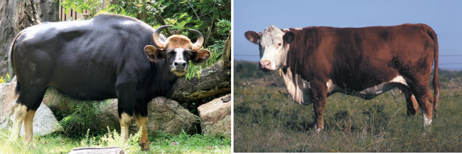
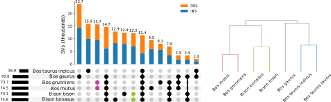
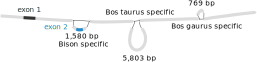
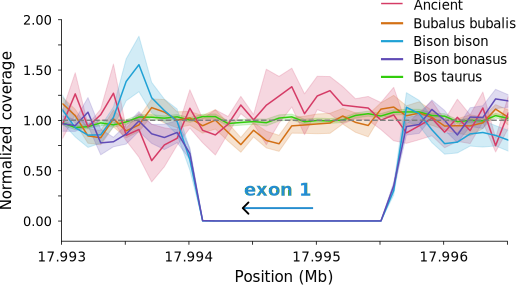
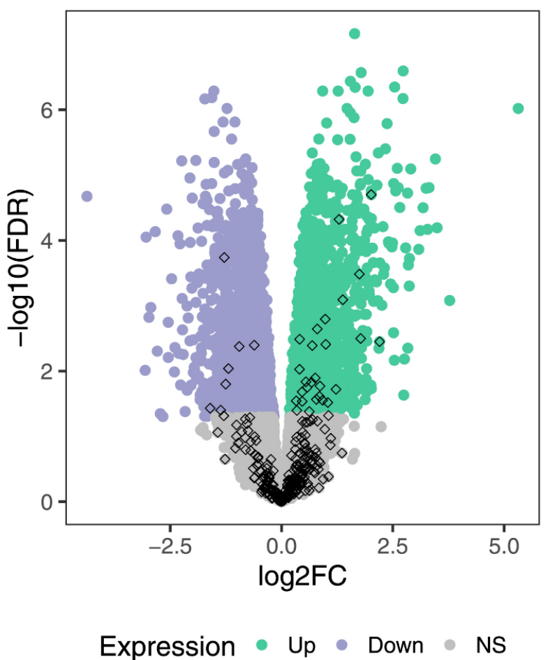
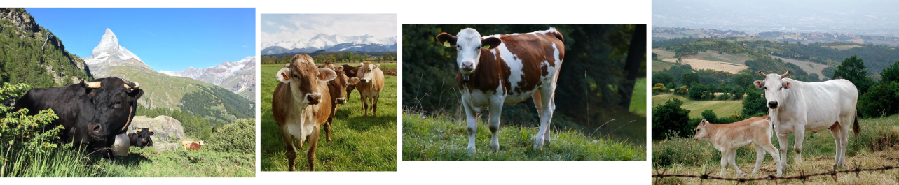
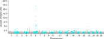
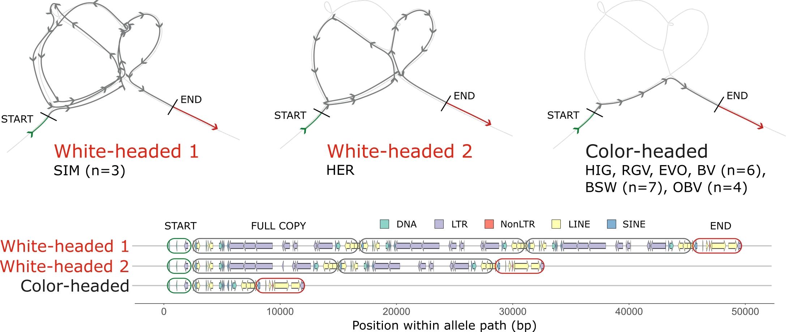
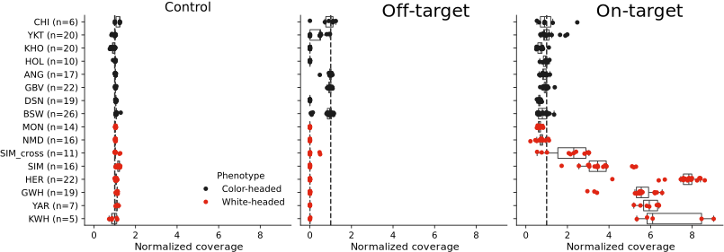

# Recap

We have learned about:

 - aligning short or long reads to pangenome graphs
 - manipulating GAF files
 - impracticalities of working with complex graphs

---

# Objectives

By the end of the lecture, we should be able to:

 - prioritise interesting regions for manual inspection
 - search pangenome graphs for disrupted genes
 - identify putative QTL bubbles associated with binary traits

---

# Overview

 - "Functional" variants
 - Easy approaches
 - Hard approaches
 - Possible future directions

---

# Functional variant hunting examples in livestock

Pangenomes are big and contain a lot of variation. \
Can we prioritise variants that are *more likely* to be meaningful?

. . .

What can we do with:

 - pangenomes
 - reference annotations
 - breed/group-specific traits
 - short read sequencing

---

# Functional variant hunting examples in livestock

Important to remember, this is just **prioritising**, not proving.

. . .

In the future, these may be the "first step" of a research project.

. . .

Some details might be simplified in the following examples.

---

# Gaur deletion of *TAS2R46*

Based on work from \
Leonard et al. **Structural variant-based pangenome construction has low sensitivity to variability of haplotype-resolved bovine assemblies**. *Nature communications* (2022).

. . .

We had one assembly for each of five cattle breeds (*B. t. taurus* and *B. t. indicus*) and one wild bovine (*Bos gaurus*).

The pangenome was built with `minigraph`.

---

# Gaur deletion of *TAS2R46*

Gaur diverged from cattle ~5M years ago, so what evolved in that time? \
Lots of mutations obviously, but which ones matter...

. . .

{ width=75% }

---

# Gaur deletion of *TAS2R46*


We start with the reference annotation, converting GFF to BED.

```ruby
1	ensembl	gene	339070	350389	.	-	.	gene_id "ENSBTAG00000006648"
1	ensembl	CDS 		350267	350389	.	-	0	gene_id "ENSBTAG00000006648"

```

. . .

*Do any of our graph bubbles overlap these genic regions?*

. . .

We can then **manually** curate the **handful** of "affected" genes.

---

# Gaur deletion of *TAS2R46*

BTA5 has a 17 Kb deletion **unique to gaur** that spans

 - *TAS2R46*
 - *ENSBTAG00000001336*

. . .

{ width=65% }

. . .

Easy to find as the bubble totally overlaps the genic regions.

---

# eVNTR for *LOC112449094* in cattle

Based on work from \
Leonard et al. **Graph construction method impacts variation representation and analyses in a bovine super-pangenome**. *Genome Biology* (2023).

. . .

Pangenome containing seven *B. t. taurus*, two *B. t. indicus*, and three wild bovine (*Bos gaurus*, *Bos grunniens*, and *Bison bison*).

. . .

Looking at VNTR (variable number tandem repeat) copy numbers in the graph.

. . .

Graphs were build with `pggb`, `cactus`, and `minigraph`, with similar results.

---

# eVNTR for *LOC112449094* in cattle

We found a big outlier in copy number between non-cattle and cattle. \
We prioritised it for following up.

. . .

{ width=85% }

. . .

We later found within-breed variability in Braunvieh for which we had RNA-seq. \
This was not in the graph, but inspired by finding this example.

---

# eVNTR for *LOC112449094* in cattle

We found a strong association for increased *LOC112449094* expression with additional VNTR copies.

{ width=85% }

. . .

We completed the story with allele-specific expression in the Nellore x Brown Swiss (this was in the graph).

---

# Wisent deletion of *THRSP*

Based on work from \
Bortoluzzi et al. **Wisent genome assembly uncovers extended runs of homozygosity and a large deletion that inactivates the thyroid hormone responsive gene**. *Biorxiv* (2024).

. . .

European (and American) Bison diverged ~1.5M years ago from cattle, and also have distinct habitats/adaptions.

---

# Wisent deletion of *THRSP*

We can be a bit more precise, and look for *clade-specific* SVs that overlap genes.

. . .

{ width=95% }

. . .

Almost 16k SVs private to the yak clade and 12k SVs private to the bison clade!

---

# Wisent deletion of *THRSP*

We find a partial deletion of *THRSP* (complete deletion of exon 1).

{ width=95% }

. . .

The other exon is noncoding, so this is effectively a full knockout.

---

# Wisent deletion of *THRSP*

We have a limited sample size (*n*=2 for bison and *n*=5 for non-bison). \
SRA/ENA have many more short read sequencing datasets for bison/cattle.

. . .

There were recently even ancestral reads from auroch made public!!

. . .

{ width=85% }

---

# The good

Key takeaway

> Short read sequencing is ...

---

# The good

Key takeaway

> Short read sequencing is powerful when combined with a pangenome!

---

# The good, the bad, and the unknown

So far we've mostly examined only deletions, why?

. . .

:::incremental
 - nonreference sequence is rarely annotated
 - coordinates for insertions are not helpful
 - duplications/inversions are also not always obvious in graphs
:::


Can we find QTL *outside* of annotated elements?

---

# Functional nonreference sequence

Based on work from \
Crysnanto et al. **Novel functional sequences uncovered through a bovine multiassembly graph**. *PNAS* (2021).

. . .

We can identify tens of megabases of nonreference sequence, but then what? \
Since that sequence is *nonreference*, we likely have limited knowledge about it.

. . .

Unmapped reads now can align to the reference, so we can locally assembly a nonreference transcriptome.

---

# Functional nonreference sequence

There were **374** complete gene models!

{ width=45% }

. . .

Many related to immune functions, a region rich with SVs.

---

# Functional nonreference sequence

"Reference" genomes being annotated is practical, not ideal. \
We now can have many assemblies per population/breed/species.

. . .

Annotation is still computationally expensive, but Ensembl and others are working on pangenome annotation.

. . .

As **annotated** genomes become more readily available, "nonreference" will fade away.

---

# More general approaches

Approach the same problem but from the opposite end:

>Rather than looking for genes that are affected in the pangenome, we want find regions in the pangenome associated with traits.

. . .

How can we query the graph for such information?

---

# More general approaches

Linear equivalents to this question are:

 - GWAS
 - signatures of selection
 - $F_{st}$
 - XP-EHH

. . .

Many of which are possible in theory, but have not yet been implemented efficiently for pangenomes.

---

# White headed phenotype

Based on work from \
Milia et al. **Taurine pangenome uncovers a segmental duplication upstream of KIT associated with depigmentation in white-headed cattle**. *Biorxiv* (2024).

. . .

Let's use a simple and easy-to-record phenotype: head colour.

. . .

Crucially, these types of trait are generally breed-defined as well.

{ width=95% }


---

# White headed phenotype

We built a "large" pangenome with multiple assemblies per trait group (four white- and 19 colour-headed). \
Tested with `minigraph` and later `pggb`.

. . .

We now need to "scan" the pangenome to find potential QTL. \
But how do we scan?

. . .

Looking for segregating nodes (sequence) is a start.

. . .

Broadly, we want to find where in the graph

 - $W \approx W$
 - $C \approx C$
 - $W \not\approx C$

# White headed phenotype


We binned the graph into 1 Kb regions (according to the reference)

```bash
odgi extract -i graph.gfa -b 1_Kb_bins.bed -s
```

. . .

And then calculated the pairwise Jaccard similarity per bin

```bash
for subgraph in *.gfa
do
  odgi similarity -i $subgraph
done
```

. . .

This is conceptually straightforward...

. . .

The implementation is **not**.

---

# White headed phenotype

We define the similarity ratio as

$$ \frac{\langle J \rangle_{W \approx W} + \langle J \rangle_{C \approx C}}{2\langle J \rangle_{C \not\approx W}}$$

---

# White headed phenotype

After scanning all 29 autosome pangenomes, we find something!

{ width=95% }

---

# White headed phenotype

The peak region was near *KIT* (known to be associated with coat colour).

. . .

{ width=95% }

---

# White headed phenotype

Again we have a "large" pangenome, but a small sample size. \
We turned to public samples (including many more breeds).

. . .

{ width=95% }

---

# White headed phenotype

This study was particularly *lucky*.

 - *KIT* is a well-known gene for coat colour phenotypes
 - the SV was large but overall conserved across breeds
 - the pangenome bubble structure was not a DAG, which emphasised the CNV nature

. . .

This will need some generalisations to work with other phenotypes or different genotypes.

---

# Summary

. . .

:::incremental
 - Pangenomes are a powerful *tool* for exploring functionally relevant sequence.
 - More annotated genomes (and more genomes containing functionally different sequence) will further empower these approaches.
 - Short read sequencing is still incredibly useful **when** combined with a pangenome graph.
 - Many of these methods are still "experimental" and rarely straightforward.
:::

---

# Not the end of the line

The course will live on at

https://github.com/ASLeonard/pangenome_summer_school

All my slides and practicals are there.

. . .

Please leave

 - issues (for complaints)
 - pull requests (for suggestions)
 - or email me ([alleonard@ethz.ch](alleonard@ethz.ch))

. . .

Thank you for being patient!

---


# Practical: Using a pangenome to identify functional variants

Goals of this afternoon:

 - Identify annotated genes overlapping/near pangenomic bubbles
 - Identify pangenomic regions associated with binary phenotypes
 - Wrap up **any other** pangenomic questions

---

# Questions?

And then coffee
