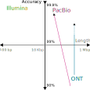

# Caveat emptor

There are not any pangenome "curriculums". \
These are ideas *we think* are useful to help apply pangenomics to your own research.

. . .

Get involved and discuss any questions or ideas of your own!

---

# Objectives

By the end of the lecture, we should be able to:

 - assemble genomes from long reads and evaluate them
 - understand common pangenome terminology and formats
 - build pangenomes graphs from input assemblies

---

# Overview

- Long read sequencing and assembly
- Some pangenome basics
- Building a pangenome

---

# Sequencing data

Genome sequencing falls in several "generations":

 - Sanger (manual)
 - "Next generation" (high throughput)
 - Third generation (long reads)

. . .

Perhaps we are due for a fourth generation designation soon...

---

# Sequencing data

Improvements in sequencing happen at a breakneck pace.

{ width=50% }

---

# Genome assembly

We most likely work with chromosomes that are too large to sequence directly. \
Genome sequencing provides us with many smaller fragments.

. . .

We need to *reassemble* all the reads to reconstruct the original genome sequence.

---

# Genome assembly — Theory

Consider the simple case

```ruby
TTAGGCAA  
    GCAAGTCCCA  
         TCCCATTAA
```

. . .

The assembled sequence would be "TTAGGCAAGTCCCATTAA".\
We call this a **contig** (refering to a **contig**uous region of the genome).

---

# Genome assembly — Theory

However, one possible type of issue

```ruby
TTAGGCAA  
    GCAAGTCATCAT  
             CATCATCATCCC  
          CATCATCATCCC
```

. . .

It is already ambiguous which read (the 3rd or 4th) is better, and so we have to "guess" the genome sequence.

---

# Genome assembly — Theory

Many genomes are unfortunately full of complex repeats that even with *perfect* reads cannot be resolved.

. . .

```ruby
TTAGGCAA  
    GCAAGTCCCA  
         TCACATTAA
           ^
```

Now, we add in sequencing errors and assembly gets even harder.

---

# Genome assembly — Theory

Various theoretical arguments for how much sequencing coverage is needed to "guarantee" we can reassemble the genome correctly.

. . .

In short, long+accurate+high coverage is the best.

---

# Genome assembly — Short reads

Confidently placing 150 (or smaller!) basepair sequencing reads was incredibly challenging. \
Absolutely no hope of spanning complex repeats.

. . .

Highly fragmented assemblies, but each piece is generally correct.

---

# Genome assembly — Long reads

Long reads solved some of the issues, but initially were extremely error-prone (>80% accuracy).

. . .

This required different assembly algorithms (de Bruijn graphs versus Overlap-Layout-Consensus).

---

# Genome assembly — Accurate long reads

With long and accurate reads, many problems disappeared.\
Assemblers like `hifiasm` ([https://github.com/chhylp123/hifiasm](https://github.com/chhylp123/hifiasm)) enabled drastic improvements in:

 - genome quality
 - compute resources
 - data required

. . .

Jarvis et al. **Semi-automated assembly of high-quality diploid human reference genomes**. *Nature* (2022)

---

# Genome assembly — Accurate long reads

Even more improvements with additional sequencing:

 - ONT ultralong reads
 - Hi-C
 - SBB/6b4 reads

. . .

Rautiainen et al. **Telomere-to-telomere assembly of diploid chromosomes with Verkko**. *Nature Biotechnology* (2023)

Q100 project ([https://github.com/marbl/HG002](https://github.com/marbl/HG002))

---

# Genome assembly — Triobinning

Accurate long reads also enabled distinguishing genomic variation from errors **on each read**.

Many samples of interest are not haploid, we want to assemble each haplotype.

{ width=50% }

---

# Genome assembly — Triobinning

For diploids, this is easier. \
We can use parental reads to assign phases *over heretozygous regions*.

. . .

For higher ploidy, this is challenging but feasible in theory.

---

# Genome assessment

How can we investigate how *good* our genome assemblies are?

. . .

Is the assembly:

 - **contiguous**?
 - **complete**?
 - **correct**?

---

# Genome assessment — Contiguity

The easiest metric has the hardest definition:

>Given a set of contigs, the N50 is defined as the sequence length of the shortest contig such that 50% of the entire assembly is contained in contigs or scaffolds equal to or larger than this value.

---

# Genome assessment — Contiguity

Basically, are the chromosomes mostly in one piece each.

{ width=40% }

---

# Genome assessment — Completeness

We can exploit evolutionary conservation!

Search the assembly for the set of **U**niversal **S**ingle-**C**opy **O**rthologs (USCOs).

. . .

Since these genes are conserved, anything that is missing contributes to "incompleteness".

---

# Genome assessment — Completeness

We can also generate *k*-mers from short read sequencing.

. . .

Any sequencing *k*-mer missing from the assembly contributes to "incompleteness".

---

# Genome assessment — Correctness

We can align the genome to the reference and call SNPs. \
The more SNPs, the more presumed errors.

. . .

**†** REFERENCE BIAS **†**

More diverged samples should have more SNPs.

---

# Genome assessment — Correctness

We again can make use of *k*-mers from short read sequencing.

. . .

Assembly *k*-mers not found in the sequencing are more confidently errors.

. . .

Assembly *k*-mers found too often or not often enough are potential false collapses/duplications.

---

# Genome assessment — Correctness

{ width=60% }

Can calculate a "QV" score from these.

---

# Genome assessment

There are many limitations to any "summary" metrics:

. . .

:::incremental
 - Many of these are global measures, but many misassemblies are local.
 - How do we pick the "best" assembly if the metrics are not strictly better in one option?
 - They were developed based on an outdated "state of the art".
:::

---

# Genome assessment

Some of these metrics are quickly becoming pointless with routine, high-quality assemblies.

. . .

How will we assess genomes in the near future? \
Will we even *need* to assess them?

---

# A quick break

And then we move into pangenomes!

---

# The original pangenome?

As uncovered by Erik Garrison, inspired by [Desmond and Colomb (2009)](https://www.sciencedirect.com/science/article/abs/pii/S1071581909000214).

Valerio Magrelli's "Campagna Romana" (1981):

{ width=70% }

---

# Pangenomes

We now have a lot of genome assemblies, what are we going to do?

. . .

We broadly want:

 - similar regions to be represented once
 - diverged regions to show that variability

. . .

This involves some alignment step and some collapsing step.

---

# Pangenomes

There is not just "one" pangenome we can build from the same input, unlike genome assembly.

. . .

Consider a region with dense variation, like SNPs every few bases. \
How should that be represented?

---

# Pangenomes


{ width=90% }

---

# Pangenomes

Ideally some happy intermediate between nucleotide-level and redundant sequence.

{ width=90% }

---

# Purpose of a pangenome

The type of graph you want may differ on your needs:

 - reference genomes
 - pangenomes for a specific analysis

. .  .

Keep in mind the needs of *your* project.

---

# Pangenome terminology

**Pangenome**: a collection of assemblies

**Graph**: a type of pangenome representation with nodes and edges

**Nodes**: some contiguous sequence

**Edges**: connection between contiguous sequences

**Bubbles**: regions of variation

---

# Genome file formats

Most sequencing data (or anything representing genomes) are in *fasta*/*q*.

Sequence alignments are generally in *SAM*/*BAM*.

Other miscellaneous files like *BED*, *GFF*, etc.

---

# Pangenome file formats

New file formats! \
**GFA**: Graphical Fragment assembly.

. . .

Three main components:

 - S-lines: the sequence of the nodes
 - L-lines: how the graph is connected with edges
 - P-lines: how a "sample" traverses the graph (*optional*)

. . .

```ruby
S s1  AATTTACC
S s2  GGTAT
S s3  T
L s1  + s2  + 0M
L s1  + s3  + 0M
L s2  + s3  - 0M
P ME  s1+,s2+,s3+x
P YOU s1+,s3+
```
. . .

There are other, less used lines (**W**alk/**J**ump).

---

# Pangenome file formats

Most downstream tools have their own "efficient" representation:

 - `.og`
 - `.vg`
 - `.xg`
 - `.gbz`

These graphs contain a lot of information. \
GFA is human-readable and can be stored better for computer operations.

---

# Pangenome file formats

GAF: **G**raph **A**lignment **F**ormat \
A graph "superset" of PAF (**P**airwise **m**Apping **F**ormat).

Similar to SAM/BAM, broadly capturing:

 - which read
 - aligns to where
 - and how good it was

 Likewise, this is human-readable, and so some tools prefer the binary version `.gam`.

---

# Building pangenomes — tools

Several types of whole-genome sequence graph builders:

 - `minigraph` ([https://github.com/lh3/minigraph](https://github.com/lh3/minigraph))
 - `cactus` ([https://github.com/ComparativeGenomicsToolkit/cactus](https://github.com/ComparativeGenomicsToolkit/cactus))
 - `pggb` ([https://github.com/pangenome/pggb](https://github.com/pangenome/pggb))
 - `pgr-tk` ([https://github.com/cschin/pgr-tk](https://github.com/cschin/pgr-tk))

. . .

Some specialised types:

 - `pangene` ([https://github.com/lh3/pangene](https://github.com/lh3/pangene))
 - `pantools` ([https://git.wur.nl/bioinformatics/pantools](https://git.wur.nl/bioinformatics/pantools))
 - `vg` ([https://github.com/vgteam/vg](https://github.com/vgteam/vg))

---

# Building pangenomes — tools

|             | $\geq 50$ bp | $< 50$ bp | Reference-based | Lossless | N+1      | Compute     |
|-------------|:------:|:------:|:---------------:|:--------:|:--------:|:-----------:|
| `minigraph` | Yes    | No     | Yes             | No       | Easy     | Laptop      |
| `cactus`    | Yes    | Yes    | No-ish          | Yes      | Easy-ish | Cluster     |
| `pggb`      | Yes    | Yes    | No              | Yes      | Rebuild  | Big cluster |

. . .

We can perfectly reconstruct any assembly from a lossless graph.

---

# `minigraph`

Add bubbles to graph one-by-one.

{ width=60% }

---

# progressive `cactus`

Solve many pairwise problems.

{ width=80% }

---

# `minigraph`-`cactus`

Add SNP-level details to a `minigraph` graph.

{ width=80% }

---

# `pggb`

"Transitive closure" ($R^{+}=\bigcup_{i = 1}^{\infty} R^i$) over all-versus-all alignments.

{ width=80% }

---

# Pangenome parameters

`minigraph` can be shaped by:

 - `-j`: divergence level
 - `-L`: minimum "bubble" size

. . .

`pggb` can be shaped by:

 - `-p`: similarity level
 - `-s`: mapping segment length

. . .

Parameter recommendations **frequently** change as the software changes.

. . .

They are also rarely *intuitive*.

---

# Pangenome naming

Having 100 assemblies with ">chr1" is unhelpful!

. . .

We can use PanSN-spec ([https://github.com/pangenome/PanSN-spec](https://github.com/pangenome/PanSN-spec)).

```ruby
[sample_name][delim][haplotype_id][delim][contig_or_scaffold_name]
```

. . .

For example:

 - "sample\_49#2#X" for chromosome X of the second haplotype of sample_49
 - "BSW#0#1" for chromosome 1 of a primary Brown Swiss assembly

---

# Pangenome naming

Some programs (e.g., `vg`, `odgi`, `wfmash`, etc.) implicitly assume PanSN-spec. \
We don't want to do impossible alignments.

. . .

Unless we want to (e.g., inter-chromosomal duplications).

---

# Pangenome coordinates

Reference genomes allowed us to *universally* refer to the same location.

. . .

InDels within individuals means coordinates rarely match between assemblies.

. . .

Uneven assembly (or true biological variation) of telo/centromeres wildly change coordinates.

---

# Pangenome coordinates

One partial solution is **rGFA** (reference GFA), used by `minigraph`.

Can refer to any non-reference sequence relative to the reference "backbone".

. . .

Adds the *SN*, *SO*, *SR* tags to the GFA.

. . .

**This still breaks if you update your graph!**

---

# Pangenome coordinates

Other tools like `pggb` and `cactus` avoid this feature/issue by being "reference-free".

. . .

Converting coordinates within a lossless graph is straightforward.

---

# Pangenome coordinates

Except when it is undefined!

{ width=75% }

---

# Building bigger pangenomes

Many large scale efforts in progress:

 - Human Pangenome Research Council
 - Vertebrate Genome Project
 - Darwin Tree of Life

Several hundreds of genomes can take millions of core hours!

---

# Building bigger pangenomes

The $N+1$ problem is a **big** problem for consortia:

 - rebuild with annual data freezes?
 - "stable" graph and "development" graph?

---

# Building bigger pangenomes

How do these problems scale for compute resources? \
What will be bottlenecks in the near future?

. . .

 - `wfmash` is $\mathcal{O}(n^2)$
 - `seqwish` is memory/disk hungry
 - `GFAffix` is almost IO bound

. . .

*Will rate of development beat the rate of sequencing?*

---

# Assembly pangenomes

Some genome assemblers start by building graphs representing variation in the sequencing reads.

. . .

*Isn't that a type of pangenome?*

. . .

Could we represent `n=2+` genomes as graphs?

Could we represent somatic mutations as graphs?

---

# Assembly pangenomes

The answer is: *maybe?*

"Graph-to-graph" alignment is a harder problem, but an intriguing idea to consider.

. . .

We will almost certainly never work with **less** variation, so what will that future look like?

---

# Summary

. . .

:::incremental
 - Accurate long reads have *effectively* "solved" genome assembly
   - Some complex organisms (plants especially) still have challenges
 - Graph pangenomes are great for representing all this newly accessible variation
 - Different pangenomes have different (dis)advantages
:::

---

# Questions?

And then coffee
