# Recap

We have learned about:

 - how accurate long reads have reshaped genome assembly
 - pangenomes are a natural step to encapsulating all the new genomes
 - There is no "one true pangenome", but each has their own strengths

---

# Objectives

By the end of the lecture, we should be able to:

 - create figures of pangenomic bubbles
 - interactively explore pangenomes with different layers of data
 - identify large-scale homology between pangenome assemblies

---

# Overview

 - local-scale visualisations
 - global-scale visualisations
 - layering visualisations with additional data

---

# Visualising genomic data

What types of genomic data do we normally try and visualise?

[//]: # (Interactive question)

---

# Visualising genomic data

IGV (**Integrative Genomics Viewer**) is a useful tool for visualising different formats of genomic data:

 - read alignments
 - bed files
 - gene annotations

. . .

*Seeing* the data can often influence later analyses. \
Too many/few reads where we expect them, overlap of variants and complex annotations, etc.

---

# Visualising genomic data

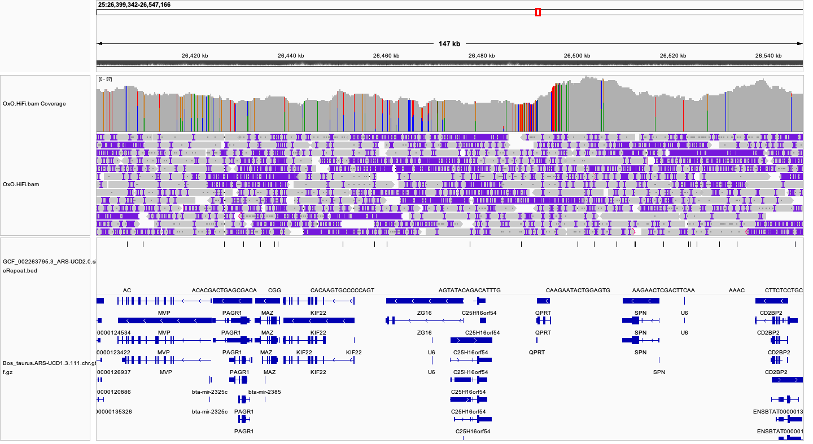{ width=100% }

---

# Visualising genomic data

There are many other ways to visualise genomic data, such as:

 - JBrowse
 - Ribbon
 - USCS Genome Browser

. . .

Is there a pangenomic equivalent?

---

# Visualising pangenomic data

**Sadly, not really...** \
Everything is more complicated in the pangenomic world.

. . .

But it depends what are we interested in:

 - viewing relationship between many assemblies?
 - viewing alignments/annotations on pangenome graphs?

---

# Visualising pangenomic data

How do we visualise the *GFA* output of pangenome construction?

One of the most common tools is `Bandage` (https://github.com/asl/BandageNG). \
It has several advantages:

 - easy to install
 - quick to load small-moderate graphs
 - lots of extra functionality

---

# `Bandage` visualisations

A relatively easy example of a minigraph bubble.

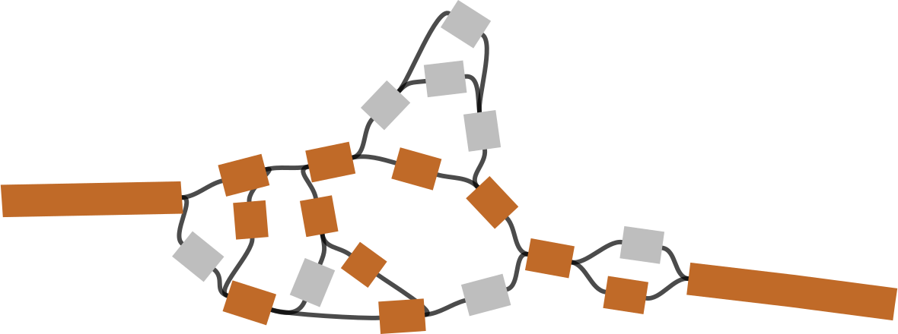{ width=80% }

---

# `Bandage` visualisations

A not-so-easy example of that region in cactus.

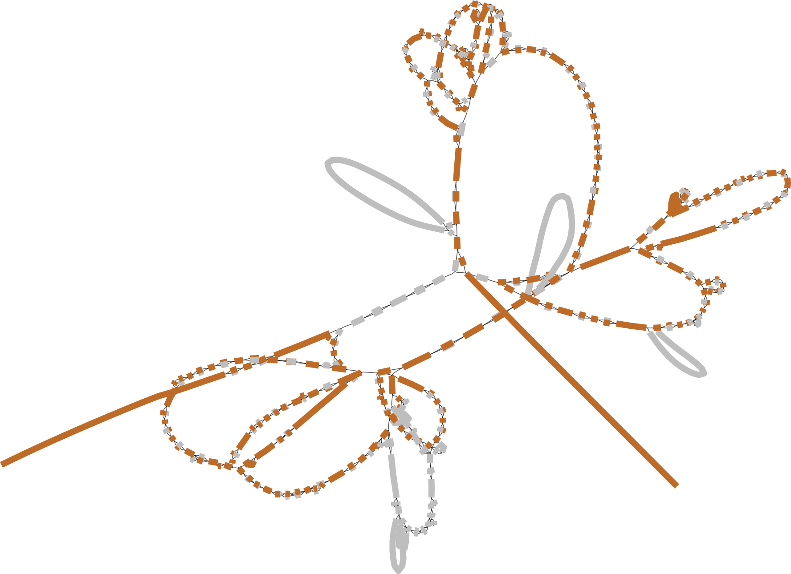{ width=80% }

---

# `Bandage` visualisations

A hard example of that region in pggb.

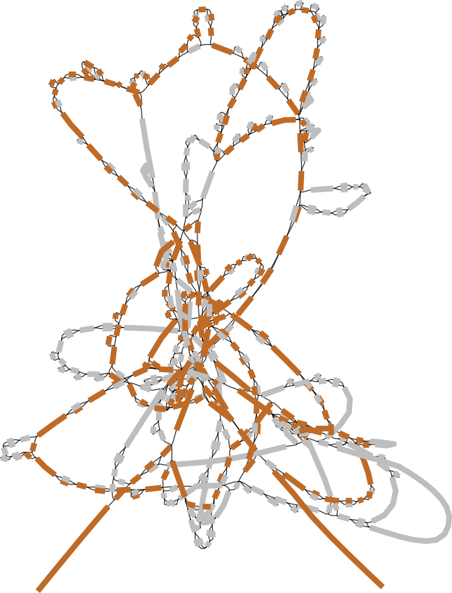{ width=60% }

---

# Using `Bandage` interactively

Beyond viewing graphs, we can also use `Bandage` for:

 - searching for sequence hits (`blastn`, `minimap2`, etc.)
 - annotating paths
 - loading BED files

---

# Using `Bandage` interactively

Let's explore `Bandage` a bit.

[//]: # (Some interactive examples)

---

# Beyond bubbles

Bandage is a powerful tool for working on a *local* scale.

How can we look at pangenomes (and the relationships between assemblies) on a *global* scale?

---

# Pangenomic synteny

Synteny Circos plot *can* be an informative way to compare assemblies.

. . .

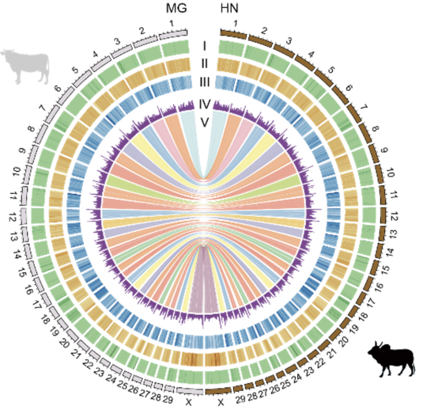{ width=50% }

---

# Pangenomic synteny

We can easily construct "multi-assembly" synteny plots.

. . .

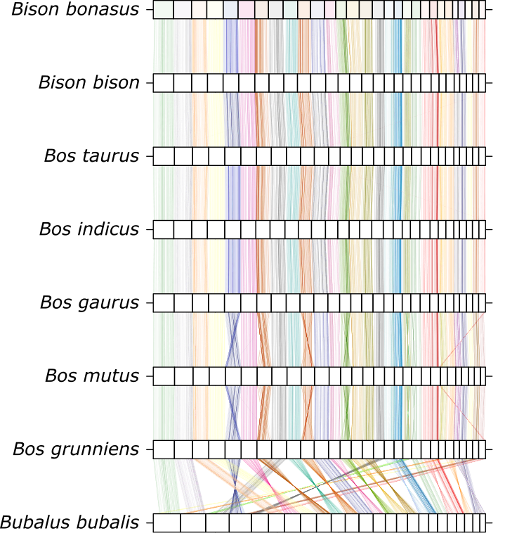{ width=50% }

. . .

But are they helpful?

---

# Pangenomic synteny

Many one-to-one alignments is **not** the same as many-to-many alignments.

. . .

Very easy to misinterpret or even miss key relationships. \
But, this can be a helpful *stepping stone* to transition to pangenomic concepts.

---

# Pangenomic synteny

Viewing too much information can be just as unhelpful as viewing too little.

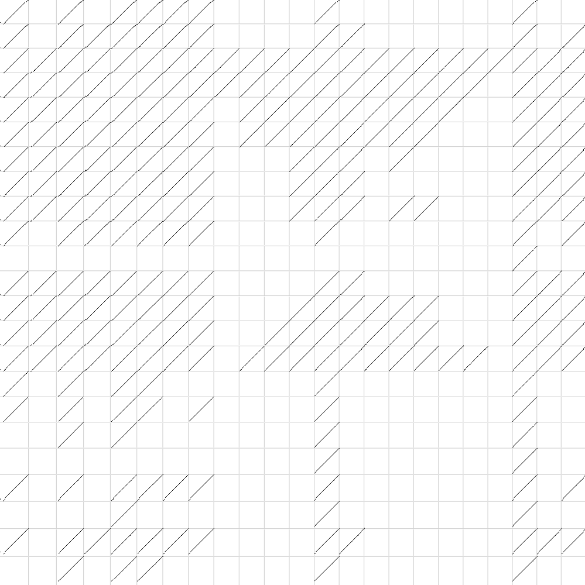{ width=50% }

---

# Pangenomic synteny

{ width=50% }

Even the variation you see is hard to relate amongst all assemblies.

---

# A quick break

And then more `odgi`!

---

# Pangenomic synteny

Another *critical* pangenome tool is `odgi` (https://github.com/pangenome/odgi).

> `odgi` is a play on the Italian word "oggi" (/ˈɔd.dʒi/), which means "today". \
>As of 2019, a standard refrain in genomics is that genome graphs will be useful in x years. \
>But, if we make them efficient and scalable, they will be useful today.

We can use `odgi viz` to get something in between 1D linear (easy) and pangenome (informative) views. \
This bins the pangenome and produces a linear, static visualisation of the graph.

---

# `odgi` visualisations

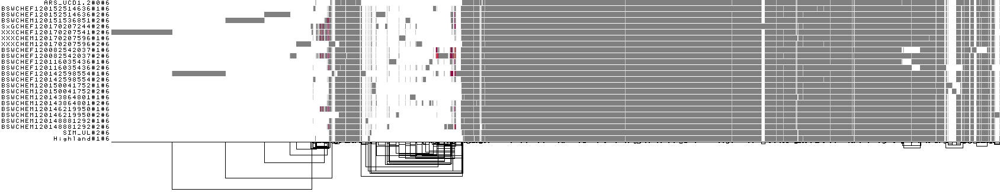{ width=95% }

. . .

Nodes are "ordered" left to right, but what does that mean? \
**THEY ARE NOT NECESSARILY SEQUENTIAL**

. . .

How do we interpret the links (graph topology)?

---

# `odgi` visualisations

We can also plot a "compressed" mode, and see which regions are variable.

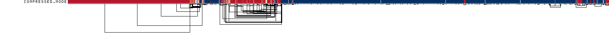{ width=95% }

---

# `odgi` visualisations

There are many additional layers of information we can use:

 - inversions
 - traversal depth
 - any annotations from BED files?

---

# `odgi inject`

We can "inject" an annotation from **any** assembly into the pangenome.

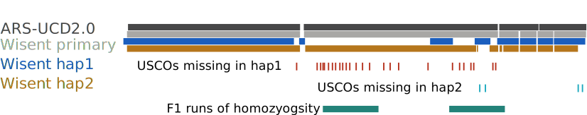{ width=95% }

. . .

Let the pangenome do the hard work for dealing with pangenome coordinates!

---

# `odgi untangle`

We can also "untangle" a graph bubble locally. \
Easier to see copy number variation or gene structure.

. . .

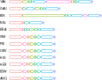{ width=50% }

---

# So linear visualisations in the end?

Pangenomes are efficient data structures.

. . .

Pangenomes can be efficient visualiation structures.

. . .

Linear sequence context will *always* make more sense.

. . .

These plots still use pangenomics before the final image.

---

# Pangenome visualisations

These tools are also likely best used in combination, so we can understand the graph at different scales.

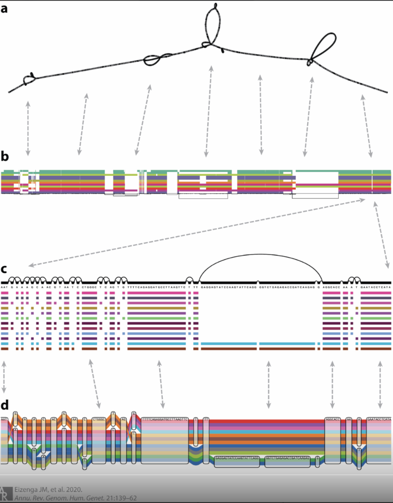{ width=70% }

. . .

"Publication figures" might focus on different "graphness" levels.

---

# Other pangenome visualisers

There are many other tools:

 - Waragraph (and earlier gfaestus; depends on odgi layout)
 - sequenceTubeMap from `vg`
 - Panache
 - Panagram

. . .

And even more "Pan" puns at https://github.com/colindaven/awesome-pangenomes.

---

# Summary

. . .

:::incremental
 - Visualising your data is **critical**, even more so for pangenomes!
 - `Bandage` is powerful for interactively exploring "local" regions.
   - Increasing graph complexity will be *impossible* to responsively display.
 - `odgi` is powerful for statically visualising entire graphs.
:::

---

# Practical: Hands on pangenome assembly of a chromosome.

Goals of this afternoon.

**Part 1:**

 - assemble an entire chromosome from long reads
 - build a chromosome pangenome from six assemblies

**Part 2:**

 - visually explore minigraph and pggb pangenomes
 - examine sequences and annotated features in pangenomes

 ---

# Questions?

And then coffee
