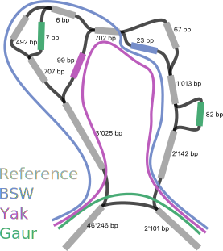

# Recap

We have learned about:

 - interactively visualising graph bubbles
 - statically visualising entire GFA files

---

# Recap

We have practiced:

 - assembling a cattle chromosome from HiFi data
 - building a chromosomal graph with minigraph
 - exploring pangenomes and regions of interest

---

# Objectives

By the end of the lecture, we should be able to:

 - determine the core and accessory components of a pangenome
 - use basic metrics to check if our pangenome is reasonable
 - understand how we can check the content of pangenomes is accurate

---

# Overview

- How do pangenomes grow with more samples
- Pangenome graph statistics
- Advanced graph assessments

---

# What makes a good pangenome graph?

**I**nternational **G**raph **G**enome **Sy**mposium (IGGSy) 2024:

. . .

> We aren't sure yet.

. . .

No real *"panalogues"* to N50, QV, USCOs, etc., because we have mixed **real biology** into our metrics.

---

# What makes a pangenome graph good?

As George Box said:

> All models are *wrong*, but some are *useful*.

. . .

Fundamentally, a good graph is a useful graph: can we answer our question?

---

# Pangenome openness

What happens when we add more samples an analysis?

With joint-genotyping in variant calling, we expect an asymptotic approach.

. . .

What do we expect for our pangenome?

---

# Pangenome openness

Consider something like Heap's law:

> describes the number of distinct words in a document as a function of the document length

. . .

$$N \propto n^{-\alpha}$$

where:

 - N is approximately the number of gene families
 - n is the number of input genomes
 - $\alpha$ is the important constant

. . .

If $\alpha > 1$, the pangenome is **closed**, otherwise if $\alpha \leq 1$, the pangenome is **open**.

---

# Pangenome openness

What happens if we add a duplicate sample to the pangenome? \
No new sequence is added, so $\alpha=\infty$ and the pangenome is **closed**.

. . .

What happens if we add a totally unrelated sample to the pangenome? \
Only new sequence is added, so $\alpha=0$ and the pangenome is **open**.

---

# Pangenome openness

We want enough samples to confidently *estimate* open/closedness.

. . .

Agriculture pangenomes may behave differently:

 - small effective population sizes per breed/line
 - many distinct breeds/lines per species
 - many closely related species

. . .

We might get "bumps" in the distribution when adding distinct samples.

---

# Pangenome layers

Pangenome openness effectively addresses the total unique sequence. \
What about different levels of intersection?

. . .

We can characterise pangenome *nodes* as:

 - **core**: present in all/most samples
 - **shell**: present in at least two samples
 - **cloud**: present in only one sample
 - **flexible**/**dispensable**: varies, but something like shell/cloud

---

# Pangenome layers

As we add many samples, the core component decreases. \
Eventually, this will just be ultraconserved elements.

. . .

Misassemblies might erroneously "demote" core segments to shell, or introduce cloud segments.

We can use this as a sanity check:

. . .

 - critical genes should be core
 - similar samples should not have too much private variation

---

# Pangenome layers

**HOWEVER** \
It is hard to distinguish assembly issues from bad pangenome building.

. . .

An uncollapsed homology could appear as a cloud segment or disrupt a core gene.

A rarely assembled region might appear as a cloud segment in a T2T genome.

. . .

But all of these cases can highlight areas worth exploring.

---

# Pangenome layers

There are several software available for pangenome openness:

 - `panacus` ([https://github.com/marschall-lab/panacus](https://github.com/marschall-lab/panacus))
 - `odgi heaps`
 - `gretl` ([https://github.com/MoinSebi/gretl](https://github.com/MoinSebi/gretl))

---

# `panacus`

Cumulative non-reference sequence in the draft human pangenome.

{ width=80% }

---

# `panacus`

Different genomic regions are differently "conserved".

{ width=80% }

---

# `panacus`

{ width=80% }

. . .

$\alpha > 1$, so the pangenome is closed!

---

# A quick break

And then quantifying graph statistics!

---

# Some other order of operations

What other basic expectations could we check?

[//]: # (Interactive question)

---

# Some other order of operations

1. Check length
1. Check average node size
1. Check node depth/frequency

. . .

We could use `gfatools stat` or `odgi stats` for example to get such information.

---

# Pangenome graph statistics

The total pangenome size should *approximately* be equal to the reference plus all variation.

. . .

There are a lot of technical considerations like how much sequence should two large but similar alleles add?

. . .

Useful to get an order of magnitude guess:

:::incremental
 - 50 Mb reference and 20 similar assemblies → 55 Mb pangenome seems reasonable
 - 50 Mb reference and 5 diverged assemblies → 60 Mb pangenome seems reasonable
 - 50 Mb reference and 5 diverged assemblies → 150 Mb pangenome surely is underaligned?
:::

---

# Pangenome graph statistics

Improving genome assemblies mean centromeres are becoming more common.

. . .

Centomeres are basically impossible to align (and thus find homology). \
This inflates the total pangenome sequence length.

. . .

The 150 Mb pangenome from 50 Mb reference and 5 diverged assemblies could be fine *if most nonreference sequence was centromeric*.

(this will be a recurring issue...)

. . .

Centromeric sequence may even dominate the graph.

---

# Pangenome graph statistics

Graphs can be described by the number of nodes and edges they contain.

Different graphs (e.g., `pggb` versus `minigraph`) may have similar length, but very different node/edge counts.

. . .

Consider the average node size (pangenome length / number of nodes) or average edge degree (number of nodes / number of edges).

Should be *reasonable* (how many bases do you expect before a SNP?).

---

# Pangenome graph statistics

We can list huge nodes from the GFA, which may be errors or regions of interest.

. . .

But this again depends on the graph builder or may be real.

---

# `gretl`

A new (but still experimental) tool.

. . .

Quick way to see different graph parameters *do* have an affect.

{ width=50% }

. . .

But which direction is the effect (better or worse)?

---

# `gretl`

We might expect *similar* samples to have *similar* levels of shell/cloud nodes.

. . .

{ width=50% }

---

# Directed acyclic graphs

Node coverage is more straightforward in a **DAG**.

Each path can use a node *once at most*.

. . .

Pangenomes with cycles can reuse nodes. \
Maybe a natural way to represent VNTRs, etc.?

. . .

But then some nodes may have extremely high depth relative to expectations.

---

# Directed acyclic graphs

On a technical level, DAGs have nicer properties, but are rare in practice.

. . .

Chandra, Gibney, and Jain. **Haplotype-aware sequence alignment to pangenome graphs**. *Biorxiv* (2023).

Ma et al. **Chaining for accurate alignment of erroneous long reads to acyclic variation graphs**. *Bioinformatics* (2023).

---

# Realignment of assemblies

Looking ahead a bit to sequence-to-graph alignment tomorrow morning...

. . .

We can realign the assemblies to the pangenome. \
Every node associated with **that assembly path** should be spanned.

. . .

From Liao et al. **A draft human pangenome reference**. *Nature* (2023):

>More than 94% of on-target edges were supported ... only 7% or fewer off-target edges were supported.

---

# Realignment of assemblies

If not, why not?

 - graph error: underaligned/collapsed region of homology
 - aligner error: nested bubbles are tricky to align to (but could that be a graph error?)

. . .

{ width=40% }

---

# Deconstructing variants

Looking ahead a bit to variant calling this afternoon...

. . .

We can also directly call variants from our pangenome graph with `vg deconstruct`. \
Getting too many or too few variants is a bad sign.

. . .

Can compare against linear-reference calls and see what is different, but some differences are real!

---

# Deconstructing variants

We also can also look for outlier variants.

. . .

Giant nodes may contribute to huge structural variants that are unlikely to be biological.

. . .

Regions with many missing genotypes may also indicate unusable local graph structure.

---

# Getting a feel for the pangenome

Ultimately, *seeing is believing*.

. . .

Pick a few random regions and just play around

 - are there similar sized nodes on different arms of a bubble?
 - are there "tightly braided" bubbles?
 - are all paths present and make sense?

---

# Getting a feel for the pangenome

This looks strange.

{ width=40% }

. . .

May actually be interesting biology???

---

# Getting a feel for the pangenome

In particular, check the region you care about!

. . .

Can also check if *known* regions match expectations.

---

# Not all problems need to be solved

*Plenty* of linear references have *plenty* of issues.

. . .

In ARS-UCD1.2, several telomeres are *near*, not at the *end*, of chromosomes.

. . .

{ width=95% }

---

# Not all problems need to be solved

As Voltaire wrote:

> Il meglio è l'inimico del bene \
"The best is the enemy of the good"

. . .

Check your graph is okay, but don't wait until it is perfect.

---

# Summary

. . .

:::incremental
 - There are no reliable pangenomic assessment metrics (yet)
 - Inspecting the graph structure *around* your region of interest is critical
 - Even a suboptimal pangenome graph may be better than a linear reference
:::

---

# Questions?

And then coffee
