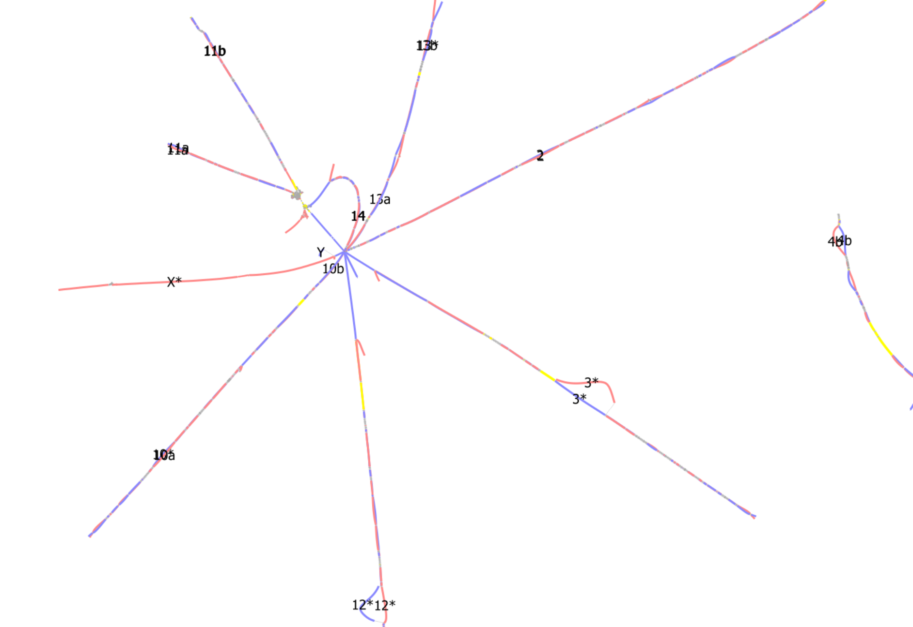
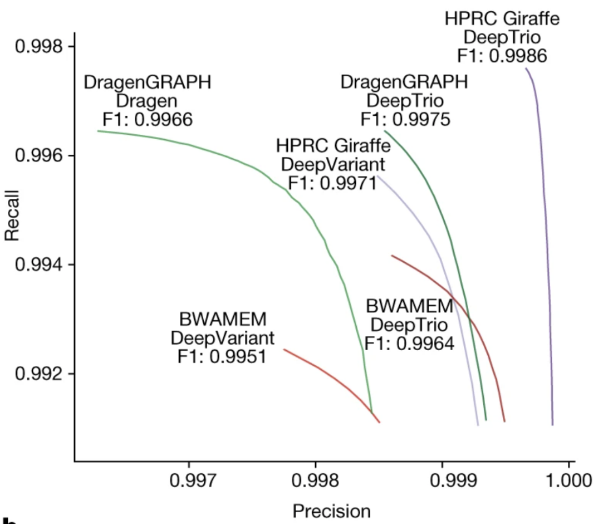
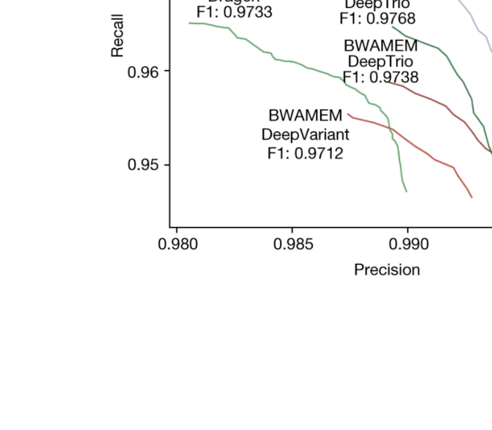

# Recap

We have learned about:

 - determining the core and accessory components of a pangenome
 - assessing the general graph metrics of a pangenome
 - the importance of useful graphs rather than perfect graphs

---

# Objectives

By the end of the lecture, we should be able to:

 - manually edit GFA files
 - understand filtering graphs
 - be aware of emerging pangenome methods

---

# Overview

 - Bandage GFA editing
 - `vg` toolkit
 - Advanced pangenomics

---

# Pangenome correction

GFAs are just text files.

. . .

We can edit text files however we want.

```ruby
S s1  AATTTACC
S s2  GGTAT
S s3  T
L s1  + s2  + 0M
L s1  + s3  + 0M
L s2  + s3  - 0M
P ME  s1+,s2+,s3+x
P YOU s1+,s3+
```

---

# Pangenome correction

Reference patching, Hi-C contact maps, etc.

Is it *hacking* or is it *curation*?

. . .

{ width=60% }

---

# `vg`

Several related commands:

 - `vg prune`
 - `vg mod`
 - `vg clip`
 - `vg simplify`

. . .

These are widely used, but inconsistently described in methods.

---

# `odgi`

Can also use `odgi` to find such regions we want to trust/remove.

```ruby
odgi depth -W 1000:10:50 -i pangenome/bovine.gfa
```

---

# The future of pangenomics

---

# The future of pangenomics (as of next month)

. . .

These are mostly pre-printed concepts.

There is little "field" and application literature.

---

# Black box pangenomes

We know pangenomes improve analyses, but some fields are hesitant to change. \
So what can we do?

. . .

How much "the algorithm" do we understand for accepted programs? \
Some degree of input → black box → output...

---

# Black box pangenomes

`vg surject` pipeline can:

 - align reads to a pangenome
 - "surject" reads back to **a** linear reference
 - variant call with `DeepVariant` from a typical BAM file

. . .

Lose some of the benefit by discarding non-reference alignments, but net positive.

---

# Black box pangenomes

Graph beats linear alignments for GIAB variants.

{ width=60% }

---

# Black box pangenomes

{ width=60% }

Even more so in challenging regions.

---

# Black box pangenomes

Similar to visualisations, linear coordinates can be easier to work with.

. . .

Especially when interacting with collaborators who don't understand pangenomes.

---

# Personalised pangenomes

Imagine a graph containing **all** variation from a population.

. . .

Currently, too much variation:

 - is prohibitively slow to work with
 - can be detrimental to accuracy (too many combinations)

 . . .

 How meaningful is rare variation anyway?

---

# Personalised pangenomes

We can create a "personal" pangenome with `vg haplotypes`.

. . .

Using *k*-mer information from our sample, we can "pick" the most relevant nodes to keep.

. . .

The resulting diploid pangenome should outperform linear or whole-pangenome alignment.

---

# Personalised pangenomes

Currently, only diploid samples are supported.

. . .

Any approach based on haplotype-paths in the graph is limiting.

. . .

Recombination and many other common biological mechanisms cannot be modelled.

---

# `impg`

Building bigger and bigger graphs is a huge challenge.

. . .

What if the region we care about is small?

. . .

"Implicit pangenome graph": lift over known coordinates from one assembly to all others.

And then build *that* pangenome.

---

# `impg`

We can reuse the `wfmash` all-versus-all alignment many times. \
So the cost is upfront and saved later on.

. . .

Still "reference-free"

---

# `impg`

Also useful for just looking into assemblies quickly.

```
S288C#1#chrI        50000  100000
DBVPG6044#1#chrI    35335  85288
Y12#1#chrI          36263  86288
DBVPG6765#1#chrI    36166  86150
YPS128#1#chrI       47080  97062
UWOPS034614#1#chrI  36826  86817
SK1#1#chrI          52740  102721
```

# Bugs bugs bugs

These are powerful new methods, but are **not stable**.

. . .

You might:

 - be stuck while the developers fix issues
 - have to rerun analyses frequently
 - not even get the code to finish

. . .

Pangenomes are high-risk but (hopefully) high-reward research.

---

# Summary

. . .

:::incremental
 - Expert knowledge can be used to manually fix GFAs
 - Filtering graphs based on depth/rarity is possible
 - Many interesting and promising pangenome approaches are on the way
:::

---

# Questions?

And then lunch
